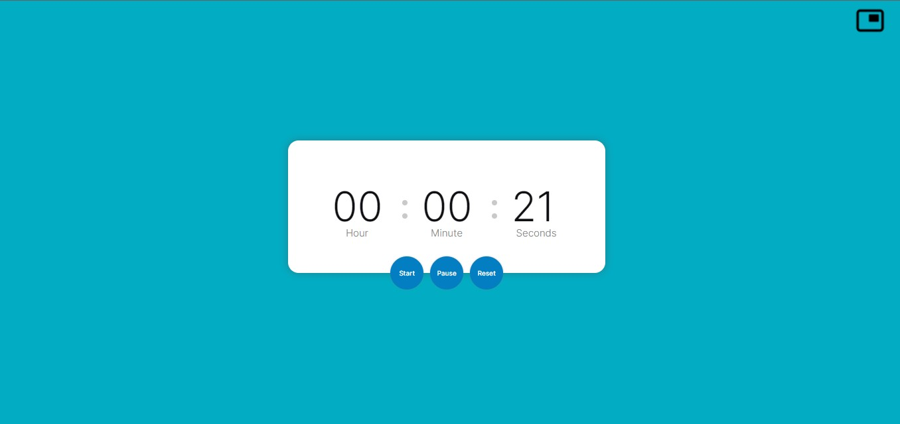
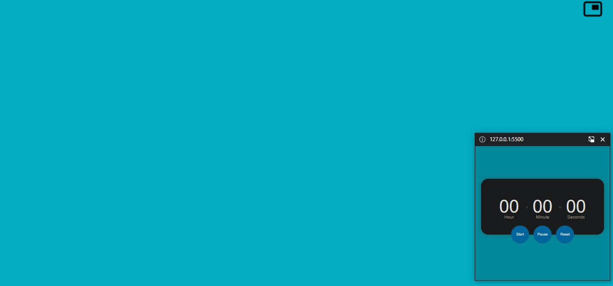

# Document Picture-in-Picture

The existing Picture-in-Picture(requestPictureInPicture()) allows HTMLVideoElement to be played in a floating window that floats on top of other windows. However, it is only limited to video.

The Document Picture-in-Picture API allows to use Picture-in-Picture window with any HTML element.

Let's see how we can use this API.

We are going to implement the Document Picture-in-Picture API to a simple timer application.



It has basic functionality to start a timer, pause the timer and reset the timer.

I have also added a PIP button in the top-right side of website which will be used to open the PIP Window.

```html
<button class="pip-button">
  
</button>
```

### Adding the event listener in PIP button

In the PIP.js file we select the button and add event listener to listen for a click to enable PIP mode.

```javascript
let pipBtn = document.querySelector(".pip-button");
let timer = document.querySelector(".stopwatch-container");
let container = document.querySelector(".container");

pipBtn.addEventListener("click", async function () {
  // ...
});
```

Notice how we have used async function in event listener because the process of requesting a PIP window is asynchronous.

We select the timer element and container beforehand because timer element is what we are going to append in the PIP window and are going to reappend it in the container element after the pip window is closed.

Inside of the event listener function we can start writing the code to implement PIP mode.

### Checking if the browser supports the documet PIP API.

First we check if the browser support PIP mode as it currently has very [limited support](https://caniuse.com/?search=documentpicture)

```javascript
//Inside of the event listener callback function
if (!("documentPictureInPicture" in window)) {
  console.log("PIP mode not supported");
  return;
}
```

Now we request the API to create a PIP window.

```javascript
//Inside of the event listener callback function
let options = {
  width: 400,
  height: 400,
};
let pipWindow = await documentPictureInPicture.requestWindow(options);
```

This returns a promise so we need to use async/await or .then/catch.

Remeber the value in the option object accepts height and width as number and not a string.

Also the pipWindow value we receive from the promise can be considered equivalent to the global "window" object but for the PIP window.

To show this, we can get the width of the PIP window just like a how we can with the global window object.

```javascript
console.log(pipWindow.innerHeight, pipWindow.innerWidth);

//equivalent to the "window.innerHeight,window.innerWidth".
```

### Pasting the timer element to the PIP window

We can append the pipContainer we selected above to the pipWindow just like we do in a normal window.

```javascript
//Inside of the event listener callback function
let options = {
  width: 400,
  height: 400,
};
let pipWindow = await documentPictureInPicture.requestWindow(options);

//apending the pipContainer
pipWindow.document.body.append(timer);
```

It will append the pipContainer to the pipWindow body.

However we still need to add the css styling to the pipWindow. For that we are going to use the easier route.

We will create a link element and set it's href location to the same location of originating window's stylesheet. And append it to the head of pipWindow.

```javascript
//Inside of the event listener callback function
let style = document.createElement("link");
style.rel = "stylesheet";
style.href = document.styleSheets[0].href;

//appending the style
pipWindow.document.head.append(style);
```

Together it would look like this.

```javascript
//Inside of the event listener callback function

if (!("documentPictureInPicture" in window)) {
  console.log("PIP mode not supported");
  return;
}
let options = {
  width: 300,
  height: 300,
};
let pipWindow = await documentPictureInPicture.requestWindow(options);
let style = document.createElement("link");
style.rel = "stylesheet";
style.href = document.styleSheets[0].href;
pipWindow.document.head.append(style);
pipWindow.document.body.append(stopwatch);
```

Now this is enough for us to get this result.



Now we need to append the timer element back to the originating window body when the PIP window closes.

The PIP window has event "onpagehide" that is executed when the PIP window is closed.

When the PIP window closes we are going to append it back to the container we selected above.

```javascript
pipWindow.addEventListener("pagehide", function () {
  container.append(timer);
});
```

### Closing a PIP window if they click on the pipButton

If the pipWindow is not active the documentPictureInPicture.window value is null. However if it is active then it will have the value of the pipWindow object. Which we can use to check if the window is active and apply the .close() method.

```javascript
if (documentPictureInPicture.window) {
  documentPictureInPicture.window.close();
  return;
}
```

This is enough for you to get started to use document Picture-in-Picture API.

If you want to learn more the references are going to be listed below.

## References

- https://developer.chrome.com/docs/web-platform/document-picture-in-picture/
- https://github.com/WICG/document-picture-in-picture/blob/main/README.md
